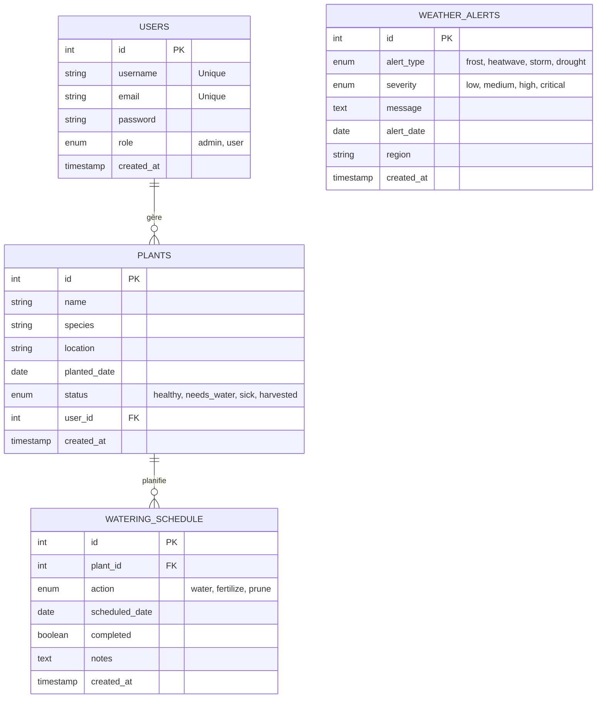

# Schéma Entité-Relation (ER) - ThinkGreen

Ce document présente le schéma conceptuel de la base de données pour l'application **ThinkGreen**.

## Diagramme ER

## Description des Tables

### 1. USERS
Stocke les informations sur les utilisateurs de l'application.
- **id**: Identifiant unique.
- **username/email**: Informations de connexion uniques.
- **role**: Définit les permissions (Administrateur ou Utilisateur standard).

### 2. PLANTS
Contient les données relatives aux plantes ajoutées par les utilisateurs.
- **user_id**: Clé étrangère reliant la plante à son propriétaire.
- **status**: État actuel de la plante pour le suivi visuel.

### 3. WATERING_SCHEDULE
Gère les tâches d'entretien (arrosage, fertilisation, taille).
- **plant_id**: Clé étrangère reliant l'action à une plante spécifique.
- **completed**: État de réalisation de la tâche.

### 4. WEATHER_ALERTS
Table indépendante stockant les alertes météorologiques régionales pour informer les utilisateurs des risques potentiels.
